# The London Urban Survival Guide — Interactive Data Story

## F21DV Data Visualisation and Analytics — Group Project

An interactive single-page dashboard exploring the relationships between Crime, Housing Prices, and Education across 33 London Boroughs (2024-2025), built with D3.js v7.

## Group Information

- Jayesh Nanekar (H00522637)
- Sahil Patil (H00493823)
- Saurabh Dhotre (H00493918)
- Yash Pawar (H00497179)
- Group 11 — Edinburgh Campus
- Professor: Dr. Le Bras Pierre

## Target Audience

Potential homebuyers, relocating families, and urban policymakers seeking to compare London boroughs across three dimensions: safety (crime), economy (housing prices), and education (school capacity). These groups typically need to cross-reference multiple scattered government datasets. This dashboard integrates all three into one cohesive view.

## Data Story Narrative

The dashboard follows a structured narrative guiding users through three questions:

1. What can I afford? (Housing prices by borough)
2. Is the area safe? (Crime patterns and types)
3. Are there good schools? (School capacity and deprivation)

The conclusion synthesises all three into a finding of "Three Londons": inner affluent, inner deprived, and outer suburban boroughs, each with distinct profiles across all three datasets.

## Datasets

| Dataset | Source | Raw Records | London Records | Key Attributes |
|---------|--------|-------------|----------------|----------------|
| Crime | Metropolitan Police via UK Police Open Data | 1,231,481 | 1,225,272 | Borough, Month, Crime_Type, Count |
| Housing | HM Land Registry Price Paid 2025 | 681,054 | 73,036 | Borough, Property_Type, Price, Date, Duration, New_Build |
| Schools | DfE Get Information About Schools 2026 | 52,235 | 3,195 | Borough, Phase, Type_Group, Capacity, Pupils, FSM_Percent, Gender, Religious_Character |

Total unique attributes: 16 (categorical, numerical, temporal, geographical)

All datasets used under UK Open Government Licence v3.0.

EDA was performed using Python (Pandas and Seaborn) during the design stage. Key insight: high housing costs do not guarantee safety. Crime density concentrates in specific boroughs regardless of property value.

## Technology Stack

- D3.js v7 — all charts, scales, transitions, data loading (local copy in libs/)
- HTML5 / CSS3 — single-page layout, CSS variables, responsive breakpoints
- Vanilla JavaScript — no other libraries or frameworks used

## Dashboard Overview

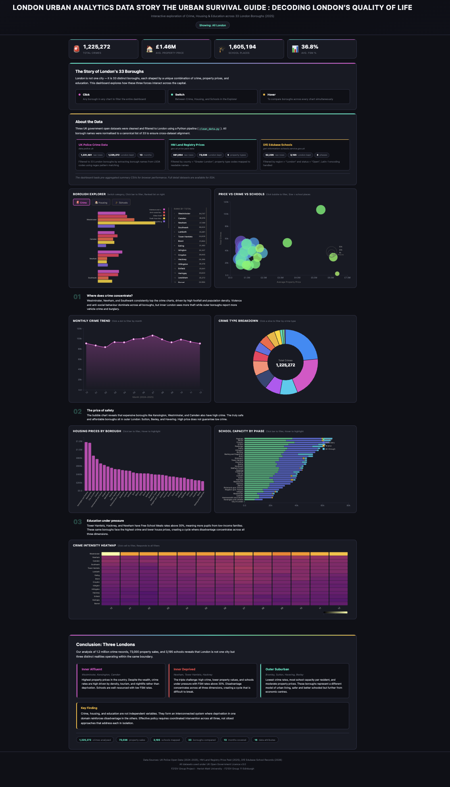

## Repository Structure
```
f-21-dv-ed-group-11/
│
├── README.md                       Project documentation (this file)
│
├── Project/                        Main application
│   ├── index.html                  Single-page entry point, loads D3 and all scripts
│   ├── style.css                   Dashboard theme (dark mode, CSS variables, responsive)
│   ├── js/
│   │   ├── main.js                 Data loading, global STATE, KPI updates, cross-chart wiring
│   │   ├── chart_overview.js       Borough Explorer (Crime/Housing/Schools grouped bars)
│   │   ├── chart_bubble.js         Bubble scatter (X=Price, Y=Crime, Size=School capacity)
│   │   ├── chart_line.js           Animated line chart (monthly crime trend)
│   │   ├── chart_donut.js          Donut ring chart (14 crime types, dynamic centre text)
│   │   ├── chart_housing.js        Vertical bar chart (avg flat prices per borough)
│   │   ├── chart_schools.js        Vertical stacked bar chart (school capacity by phase)
│   │   └── chart_heatmap.js        Heatmap grid (Borough x Month, Turbo colour scale)
│   ├── data/
│   │   ├── crime_by_borough_month_type.csv   Aggregated crime (Borough x Month x Type)
│   │   ├── crime_by_borough.csv              Borough totals for bubble chart
│   │   ├── housing_summary.csv               Avg/median price by Borough x Property Type
│   │   └── schools_summary.csv               School stats by Borough x Phase
│   └── script/
│       └── clean_data.py           Filters raw data to London, normalises names, exports CSVs
│
├── libs/                           Local copy of D3.js v7 library
│
├── img/                            Dashboard screenshots for documentation
│
└── raw_data/                       Original unprocessed datasets (not included in Canvas submission)
    ├── merge_police.py             Merges 13 monthly Metropolitan Police CSV files
    ├── london_crime_full_merged.csv    Merged police data (1,231,481 rows)
    ├── pp-2025.csv                     HM Land Registry prices (681,054 rows)
    ├── edubasealldata20260203.csv      DfE school register (52,235 rows)
    └── police_data/                    Individual monthly police downloads
        ├── 2024-12-metropolitan-street.csv
        ├── 2025-01-metropolitan-street.csv
        ├── ...
        └── 2025-12-metropolitan-street.csv
```

## Visualisations (7 Chart Types)

The original design proposed 4 visualisations (Bar Chart, Dot-Density Map, Bubble Chart, Donut Chart). After receiving feedback during the Week 8 presentation and further development, the final implementation expanded to 7 chart types:

| # | Chart | Type | Data | Key Interaction |
|---|-------|------|------|-----------------|
| 1 | Borough Explorer | Grouped horizontal bar with category switcher | Crime/Housing/Schools | Click bar or ranked list to filter all charts |
| 2 | Price vs Crime vs Schools | Bubble scatter | All 3 datasets joined | Click bubble to filter, size encodes school places |
| 3 | Monthly Crime Trend | Animated line with area fill | Crime by month | Click dot to filter heatmap by month |
| 4 | Crime Type Breakdown | Donut ring | Crime by type | Click slice to filter line and heatmap by type |
| 5 | Housing Prices | Vertical bar | Avg flat price per borough | Click bar to filter all charts |
| 6 | School Capacity | Vertical stacked bar | Capacity by phase per borough | Click bar to filter all charts |
| 7 | Crime Intensity | Heatmap grid | Borough x Month | Click cell to filter, responds to all 3 filters |

### Chart 1: Borough Explorer

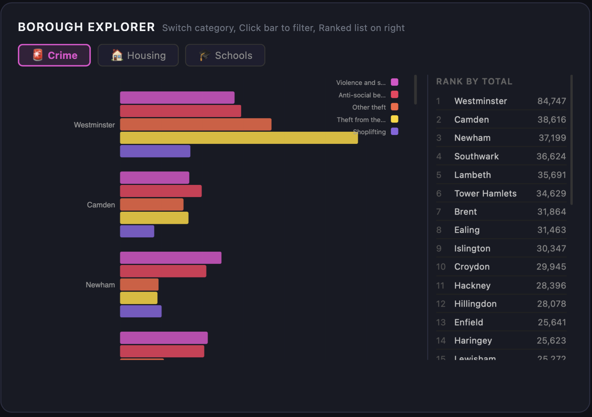
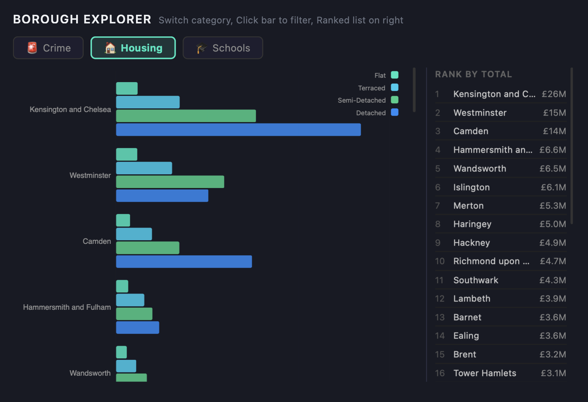

### Chart 2: Bubble Scatter

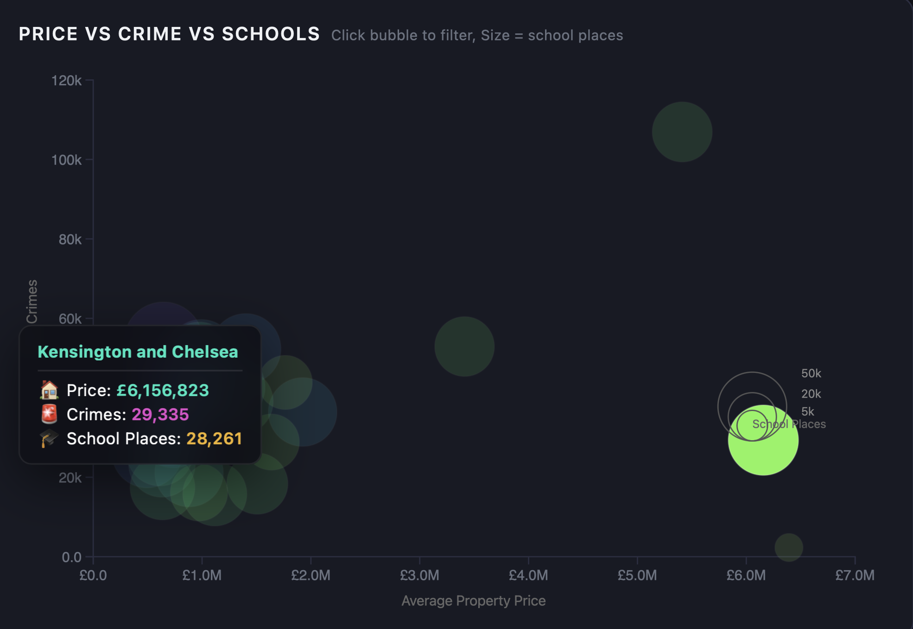

### Chart 3: Monthly Crime Trend

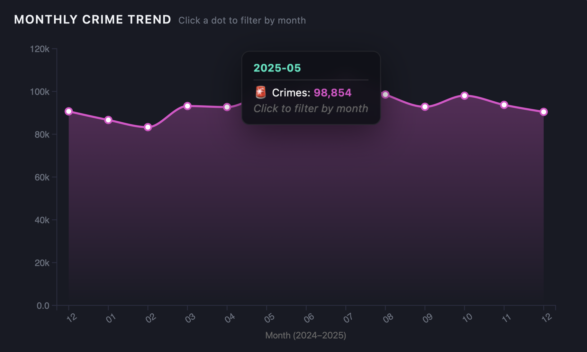

### Chart 4: Crime Type Donut

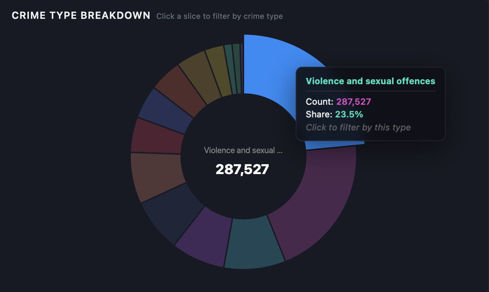

### Chart 5: Housing Prices

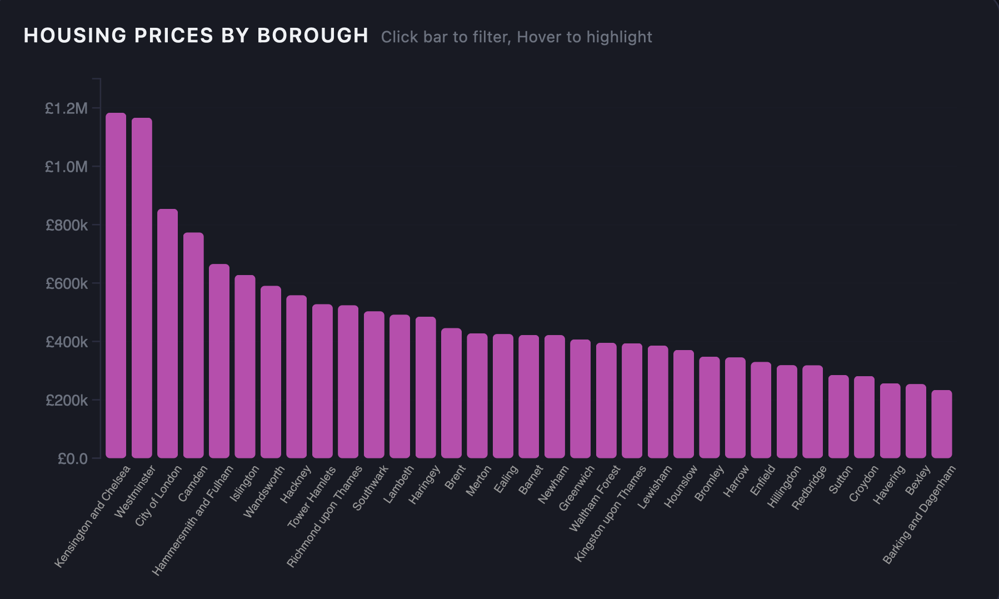

### Chart 6: School Capacity

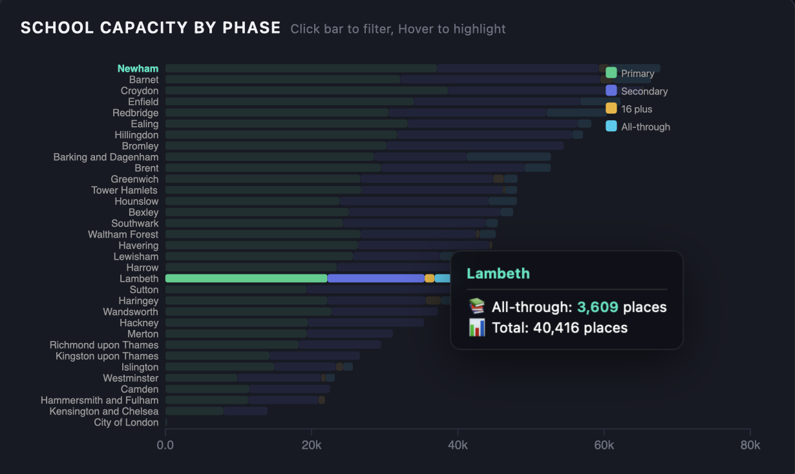

### Chart 7: Crime Intensity Heatmap

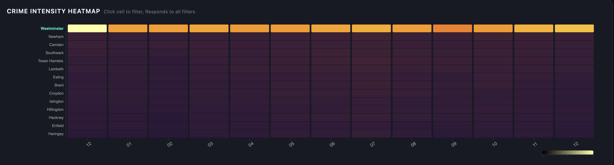

## Changes from Original Design

| Original Design (Week 8) | Final Implementation | Reason |
|---------------------------|---------------------|--------|
| Dot-Density Crime Map (GeoJSON) | Borough Explorer with category switcher | External GeoJSON URL became unreliable. Explorer gives more functionality across all 3 datasets. |
| 4 chart types | 7 chart types | Added line chart, housing bar, schools stacked bar, and heatmap for richer analysis. |
| Borough dropdown filter | Click-on-any-chart filtering | More intuitive. Bidirectional interaction between all charts. |
| Semantic zooming | Linked brushing via CSS classes | Hover-based highlighting felt more natural than zoom for borough comparison. |

## Interaction System

### Global State (main.js)

The dashboard uses a central STATE object with three independent filters:
- selected (borough name or null)
- crimeType (crime type string or null)
- month (month string or null)

Any chart can update any filter by calling selectBorough(), selectCrimeType(), or selectMonth(). Each function toggles the filter and calls renderAll() which redraws all 7 charts and updates the KPI strip.

### Within Charts
- Hover tooltips on all 7 charts with consistent styling
- Hover effects: donut slices expand, bubbles enlarge, bars highlight
- Entrance animations: line draw, elastic bubbles, staggered bars, heatmap fade-in

### Between Charts (Bidirectional)
- Borough filter: clicking a borough in the Explorer, Bubble, Housing, Schools, or Heatmap updates ALL other charts (5 charts, fully bidirectional)
- Crime type filter: clicking a donut slice filters the Line chart and Heatmap
- Month filter: clicking a line chart dot filters the Heatmap
- Linked brushing: hovering a borough in any chart highlights that borough across all 7 charts using CSS data-borough attributes (no re-rendering, instant)

As proposed in the design presentation, cross-filtering ensures that selecting a borough updates all charts dynamically. Dynamic hover tooltips show exact values on demand.

### Click Filter Demo

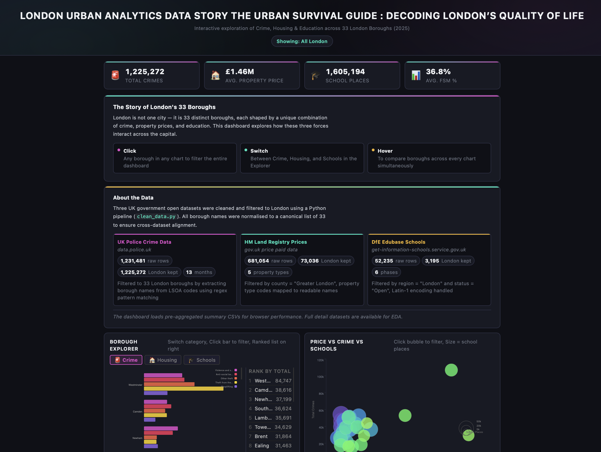
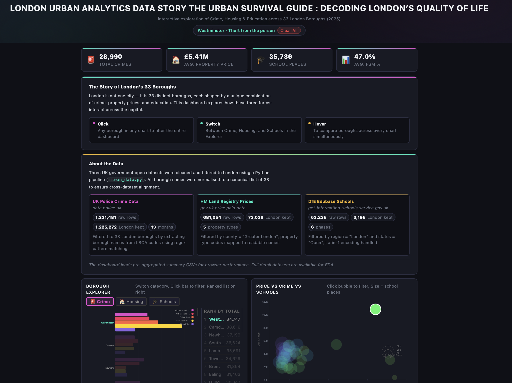

### Hover Linked Brushing Demo

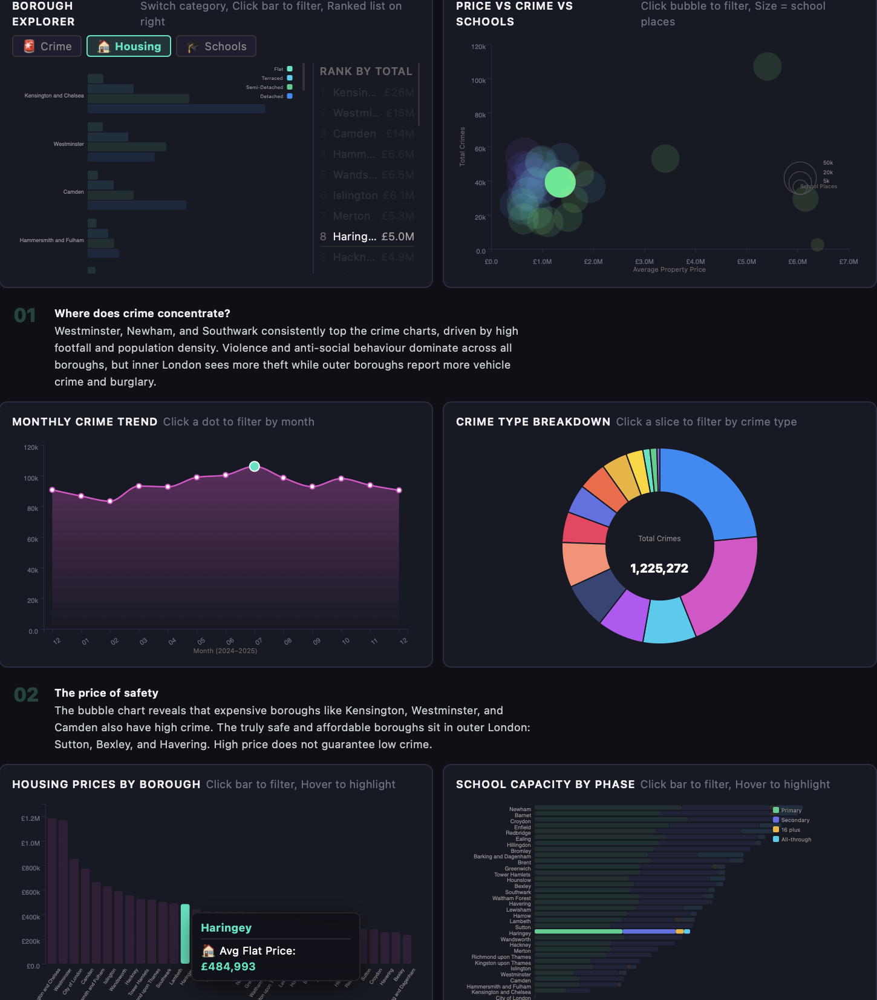

### Crime Type Filter Demo

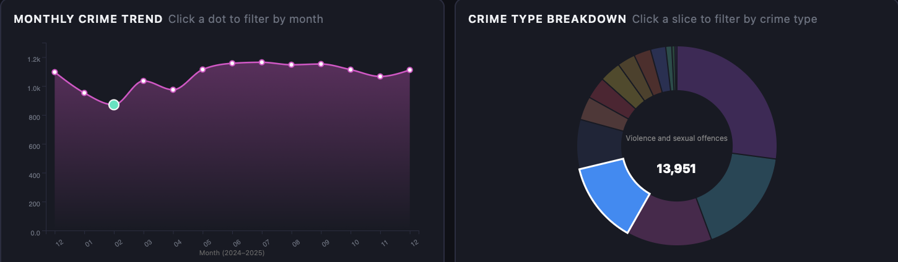

### Month Filter Demo

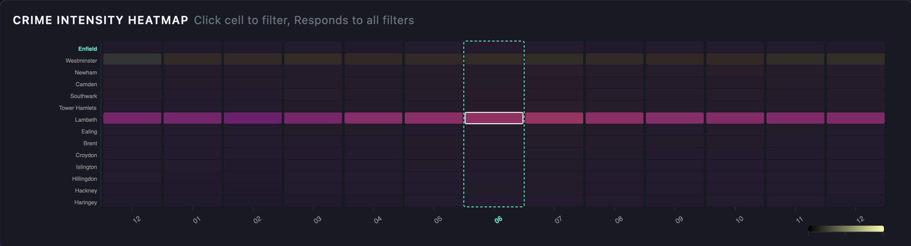

### KPI Strip
Four cards update dynamically based on active filters:
- Total Crimes (filtered by borough + crime type + month)
- Avg Property Price (filtered by borough)
- School Places (filtered by borough)
- Avg FSM % (filtered by borough)


Numbers animate smoothly between values using d3.interpolateNumber.

## Data Story Sections

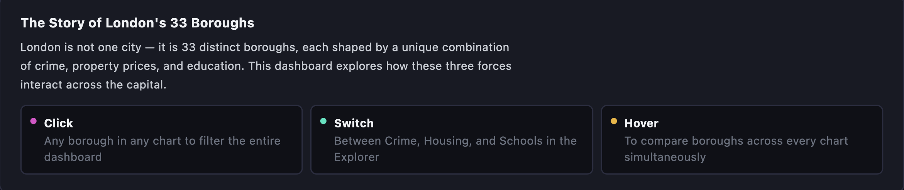
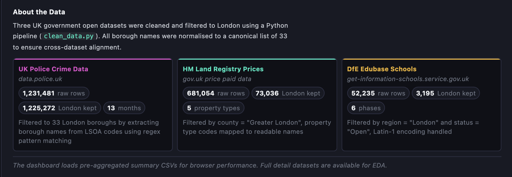
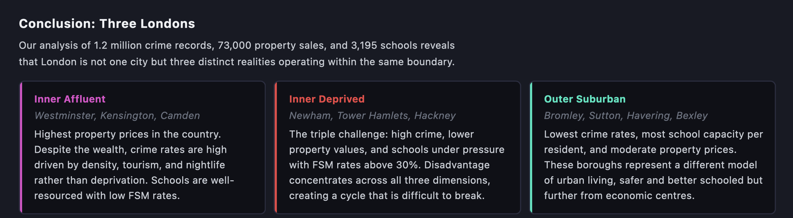

## Data Processing Pipeline

Raw UK-wide data -> Python scripts -> London-only aggregated CSVs -> D3 browser loading

1. raw_data/merge_police.py: Reads 13 monthly Metropolitan Police CSVs from raw_data/police_data/ and merges them into london_crime_full_merged.csv (1,231,481 rows)
2. Project/script/clean_data.py (~300 lines): Reads the 3 raw files from raw_data/, filters to London boroughs using regex extraction from LSOA names and county/region fields, normalises borough names via lookup dictionary, exports 4 summary CSVs to Project/data/

To regenerate the data files:
```
cd raw_data
python merge_police.py
cd ../Project/script
python clean_data.py
```

## How to Run

1. Navigate to the Project folder and serve with any HTTP server:
```
cd Project
python -m http.server 8000
```
2. Open http://localhost:8000 in Chrome, Firefox, or Edge

No internet connection required. D3.js is loaded locally from libs/ and all data is loaded from local CSV files.

## Canvas Submission

The .zip submission should contain only code (no datasets):
- Project/ folder (index.html, style.css, js/, script/)
- libs/ folder (D3.js)
- img/ folder (screenshots)
- README.md

Exclude raw_data/ and Project/data/ from the submission as per coursework instructions.

## Responsive Design

The dashboard adapts to 4 breakpoints:
- Desktop (1200px+): two charts per row
- Tablet (900-1200px): large charts go full width
- Small tablet (600-900px): all charts stack, KPIs in 2x2 grid
- Phone (below 600px): single column, hints hidden

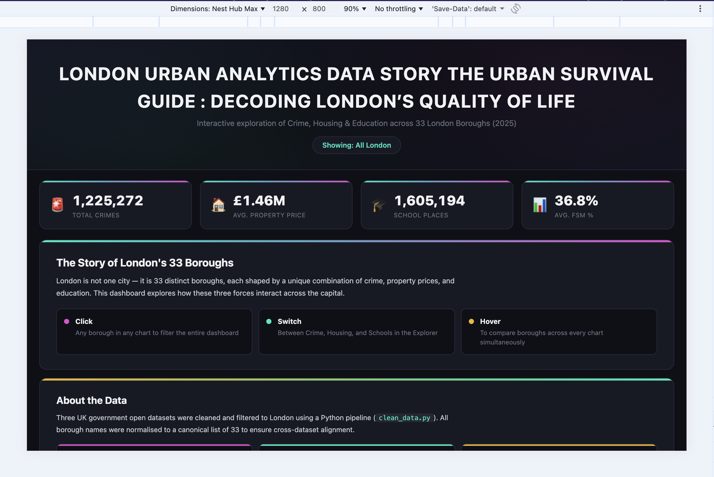
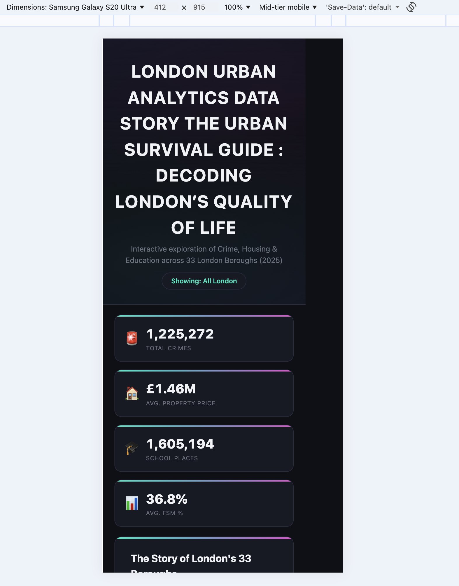

Window resize triggers a debounced re-render of all charts.

## Accessibility

- aria-labels on all panels, KPI cards, and interactive elements
- role="img" on chart containers
- role="tooltip" on tooltip element
- aria-hidden="true" on decorative icons
- aria-live="polite" on filter indicator
- Colourblind-safe Turbo scale on heatmap

## Licence

All datasets used under UK Open Government Licence v3.0:
- Crime data: Metropolitan Police via UK Police Open Data (data.police.uk)
- Housing data: HM Land Registry Price Paid (gov.uk)
- School data: DfE Get Information About Schools (get-information-schools.service.gov.uk)